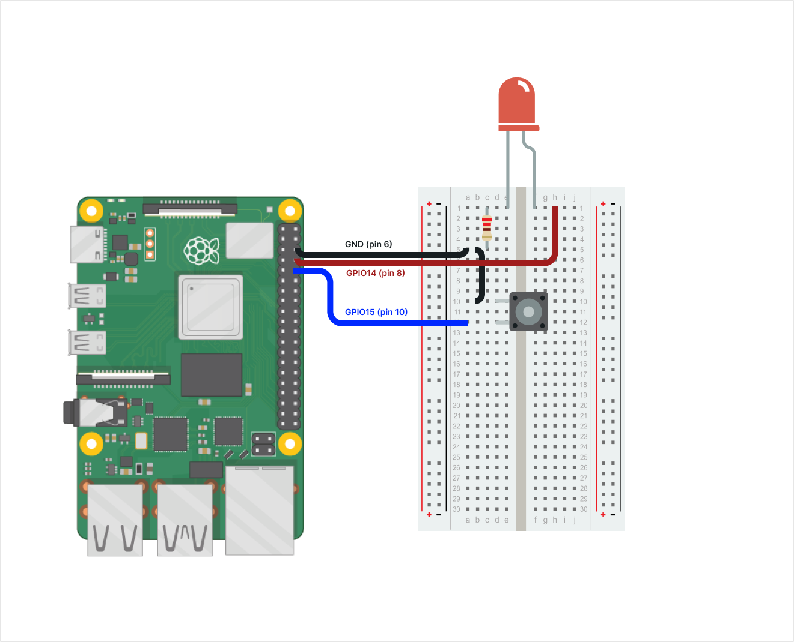
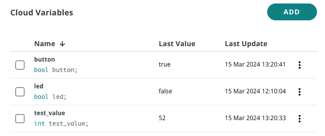
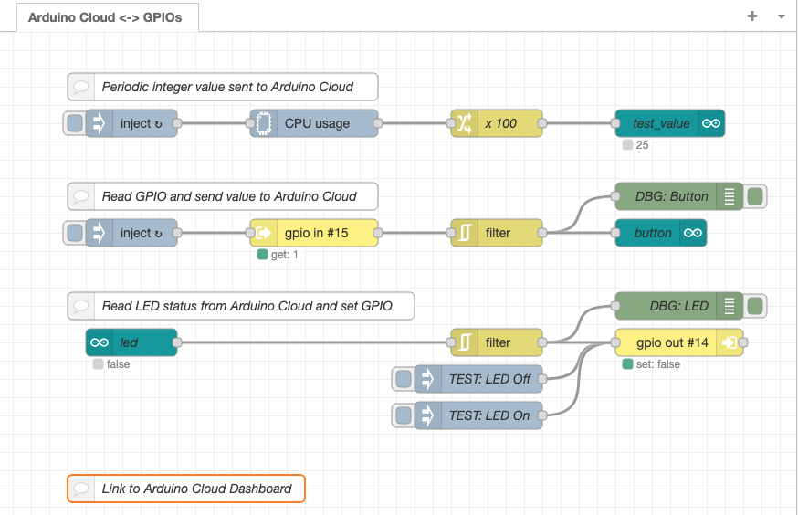
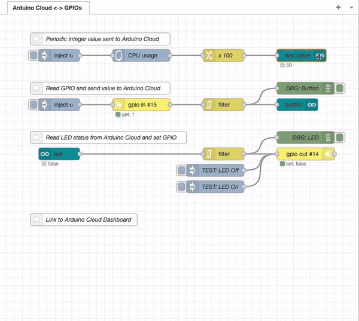
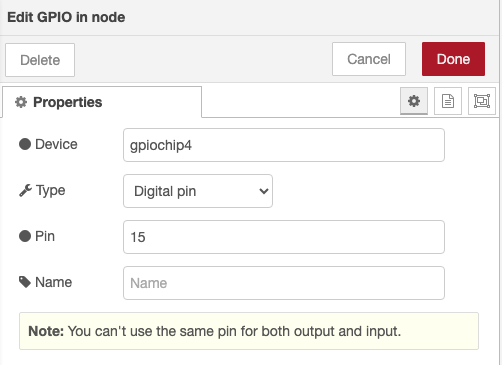
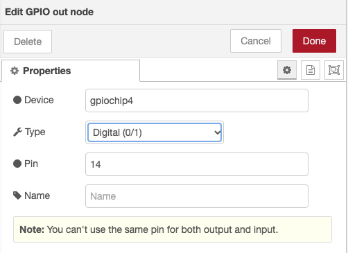
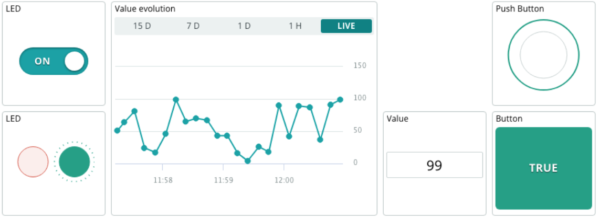

# Raspberry PI GPIO Basic control with Node-RED using Arduino Cloud

This project shows how to interact with the Raspberry Pi GPIOs from a dashboard created using Arduino Cloud with an application programmed in Node-RED. It can serve as an example to create your own applications that require access to RPI GPIOs and that can be ultimately controlled using a dashboard. 

## The setup

In this project I have used a Raspberry Pi 5 connected to an LED and a push button, both inserted in a breadboard. This is the diagram



> Note: This project should work with any Raspberry Pi version and actually with any Linux-based machine that supports libgpiod. Please, drop your comments in **Issues** if it does not work with your board in order to review it.

## How to create your project

The process to use this project is very straighforward:
1. Create the Device and Thing in the Arduino Cloud and get the Arduino Cloud API Key
2. Install Node-RED and required nodes
3. Develop the Node-RED application
4. Create the Arduino Cloud dashboard
5. Test everything

## 1. Create the Device and Thing in the Arduino Cloud

> Note: Before getting started, make sure that you have an [Arduino Cloud account](https://cloud.arduino.cc/home/?get-started=true)

### Create the Device 
Go to the [Devices](https://app.arduino.cc/devices) section of the Arduino IoT Cloud and click on **+ DEVICE**. 

Select **Any Device** and follow the instructions on the wizard.

> Note: Save your `Device ID` and `Secret Key` as they will be used in your code.

### Create the Thing 
In your recently created device page, go to the Associated Thing section, click on **Create Thing** and rename it.

> Note: You can also create the Thing from the [Things list](https://app.arduino.cc/things) and associate it later.

### Create the Variables 
Add the variables by clicking on the ADD button. At the end of the process, your list of variables should look like this.

| Name                | Type       | Description |
|---------------------|------------|-------------|
| button              | Boolean    | It will hold the status of the physical button |
| led                 | Boolean    | The variable that we will use to act over the physical LED |
| test_value          | Integer    | This is a value that will change periodically in the application |

> Note: All the variables have to be READ-WRITE. You can define the periodicity you wish or set them with the policy ON-CHANGE.

This is a screenshot for reference.



### Get an Arduino Cloud API key 

The process to get an Arduino Cloud API key is very straightforward:
1. Go to https://cloud.arduino.cc/home/api-keys.
2. Click on **CREATE API KEY**, enter a name. 
3. Note down the `Client ID` and `Client Secret` or download the PDF. We will use these credentials in the Node-RED node later.

## 2. Install Node-RED and required nodes

### How to install Node-RED
There are many ways to install Node-RED in a Raspberry Pi or any other machine. Typically, you can use: docker, snap, apt, native node.js installation.
The tricky point is that we want our Node-RED instance to have access to the GPIOs and host system. This can be achieved with all the installation methods but for most of them it is quite difficult to achieve and many conflicts and issues need to be solved. So, the easiest and recommended way in this project would be to do a native installation using NPM.

These are the instructions
1. Node-RED Installation
Install Node-RED with the following command
```
sudo npm install -g --unsafe-perm node-red
```

2. Manage the service
There are many tools that can be used to manage the service, but I recommend using pm2 to manage the service and make it start on boot.

Install pm2
```
sudo npm install -g pm2
```

Edit the `pm2.json` file and set the full path to your `gpio-basic` folder
```
{
  "apps": [
    {
      "name": "node-red",
      "script": "<FULL_PATH_TO_YOUR FOLDER>/pm2-node-red-start.sh"
    }
  ]
}
```

Launch the service, save it and enable pm2 to start on boot:
```
sudo pm2 start pm2.json
sudo pm2 save
sudo env PATH=$PATH:/usr/bin $(which pm2) startup systemd
```

The service will be launched automatically on boot.
You can manually start or stop the service with `sudo pm2 start node-red` or `sudo pm2 stop node-red`.

### Open Node-RED
Open a browser a introduce the URL: `http://<IP_ADDRESS>:1880`, replacing <IP_ADDRESS> with the IP Address of your Raspberry Pi.
Your Node-RED environment will be opened.

If everything was properly configured, you should see the flow



> Note: If you can't see the flow and there's just an empty screen, you can
> * review the configuration (maybe the folder is not set properly)
> * or you could also import the flow.json pasting the content directly using **Menu-->Import**

### Install the required nodes
The first time, you will probably get some messages indicating that there are nodes missing. It is because the application requires the following nodes:

* **node-red-contrib-libgpiod**: The nodes needed to interact with the GPIOs
* **@arduino/node-red-contrib-arduino-iot-cloud**: The nodes to communicate with Arduino Cloud
* **node-red-contrib-cpu**: I have used this node to generate an integer value that is sent to the Cloud. In this case I send the CPU load. 

In order to install the nodes, you just have to click on **Menu-->Manage Palette** on the menu.
Then go to the **Install** tab, search for the modules listed above and install them.

## 3. Develop your Node-RED application

If everything worked correctly, you should see the picture shown above.

Now, it's time to configure the nodes.

### Configure the Arduino Cloud nodes

First, let's configure the Arduino Cloud nodes. For each node, you have to do the following:
1. Select the Connection
> Note: The first time, you will have to set up the Connection and introduce the API secrets `Client ID` and `Client Secret`.  
2. Select the **Thing** from the dropdown menu
3. Select the **Property** (the variable) from the dropdown menu
4. Check the `Send as device` box
5. Select the **Device** from the dropdown menu

As a reference, you can see the full process in action for one node in the animated GIF below:



### Configure the GPIO nodes

First, let's configure the GPIO IN node. Double click on the node and set:
* Device --> Set your `gpiochipX` (gpiochip4 in the example)
* Type: Digital pin
* Pin --> Set your pin number



Next, let's configure the GPIO OUT node. Double click on the node and set:
* Device --> Set your `gpiochipX` (gpiochip4 in the example)
* Type: Digital (0/1)
* Pin --> Set your pin number



### Deploy

Deploy the flow by clicking on the **Deploy** button on the top-right corner.

## 4. Create the Arduino Cloud dashboard

The dashboard that we are going to build will look like this



There are 2 ways to create the dashboard:
1. Create it manually. Replicate the one shown above following the instructions in [this guide](https://docs.arduino.cc/arduino-cloud/cloud-interface/dashboard-widgets/).
   - The LED widgets should be linked to the variable led
   - The Value widgets should be linked to the variable test_value
   - The Button widgets should be linked to the variable button
2. Clone the one provided by this tutorial following the instructions in the [Annex](README.md#clone-the-dashboard-using-cloud-cli)

## 5. Test everything

You should now see the following:
* Every time push the physical button, the button widget should be updated
* Every time you change the LED widget in the dashboard, the physical LED should switch to ON or OFF
* The value of `test_value` should reflect the Raspberry PI CPU load updated every 5s, and you can see the evolution on the dashboard

Enjoy!

## Additional information
### Arduino Cloud
[Arduino Cloud](https://cloud.arduino.cc/) is a platform that simplifies the process of developing, deploying, and managing IoT devices. It supports various hardware, including Arduino boards, ESP boards and any device programmed with Python, Javascript or Node-RED. It makes it easy for makers, IoT enthusiasts, and professionals to build connected projects without high programming skills.

The platform allows for easy management and monitoring of connected devices through customizable dashboards, which provide real-time visualisations of the device's data. The dashboards can be accessed remotely through the mobile app Arduino IoT Cloud Remote, which is available for both Android and iOS devices, allowing users to manage their devices from anywhere.

#### Clone the dashboard using Cloud CLI

As described in the tutorial, you can create the dashboard on your own, but here I will show you a very handy trick so that you can just make a copy of a template that I have created. For that, you need to use [Arduino Cloud CLI](https://docs.arduino.cc/arduino-cloud/arduino-cloud-cli/getting-started/).

The steps are the following:
1. Download and extract the latest release.
Download it from [here](https://github.com/arduino/arduino-cloud-cli/releases)
Make sure it is in your machine's PATH, so that it can be used globally.
After installation, check that it is working by opening a terminal, and type:

2. Set your credentials
To authenticate with the Arduino Cloud, we will need to first set our credentials, using our clientId and clientSecret which are obtained from the Arduino Cloud [API keys section](https://app.arduino.cc/api-keys). Run the following command and introduce the credentials:
```
arduino-cloud-cli credentials init
```

3. Create the dashboard

```
arduino-cloud-cli dashboard create \
		--name <Your-Dashboard_Name> \ 
		--template rpi-gpio-basic-dashboard.yaml \ 
		--override Raspberry-Basic-GPIO=<Your-Thing-ID>
```
Replace *\<Your-Dashboard-Name\>* and *\<Your-Thing-ID\>* with your actual data.

### GPIOs and Raspberry Pi
There are many GPIO libraries that can be used with Raspberry Pis. Among some of the most popular, we can find: onoff, jonhny-five, rpi-gpio, gpiozero, .... One of the issues that I found is that some of the libraries only work for certain versions of RPI. For instance, the new RPI 5, has a brand new chipset for managing GPIOs, and not all the libraries work for it.

#### **GPIOD** library

After a lot of googling and searching, I ended up using *libgpiod* as it is the one supported by the Linux kernel team directly and it can be used across all the RPI flavours and any other Linux-based machine.

##### Installation
First, you have to install library in the system.
If you are using Ubuntu or any other Debian-based machine, you can follow these instructions

```
sudo apt install gpiod libgpiod2 libgpiod-dev libnode-dev
```

In this project, we are using `node-red-contrib-libgpiod` which is the official Node-RED node. The installation process is described above: just add the node using the **Menu-->Manage Palette** option.

##### Notes
The GPIOD API has evolved quite a lot over time. The versions before 2.0.0 have a different API than the newer ones. 

If you want to check what is the gpiochip and line that you have to use in the code, you can use the following command line commands.

This is an example of the output in a Raspberry PI 5
```
$ sudo gpiodetect 
gpiochip0 [gpio-brcmstb@107d508500] (32 lines)
gpiochip1 [gpio-brcmstb@107d508520] (4 lines)
gpiochip2 [gpio-brcmstb@107d517c00] (17 lines)
gpiochip3 [gpio-brcmstb@107d517c20] (6 lines)
gpiochip4 [pinctrl-rp1] (54 lines)
$
$ sudo gpioinfo gpiochip4
gpiochip4 - 54 lines:
	line   0:      "ID_SD"       unused   input  active-high 
	line   1:      "ID_SC"       unused   input  active-high 
	line   2:       "PIN3"       unused   input  active-high 
	line   3:       "PIN5"       unused   input  active-high 
	line   4:       "PIN7"       unused   input  active-high 
	line   5:      "PIN29"       unused   input  active-high 
	line   6:      "PIN31"       unused   input  active-high 
	line   7:      "PIN26"   "spi0 CS1"  output   active-low [used]
	line   8:      "PIN24"   "spi0 CS0"  output   active-low [used]
	line   9:      "PIN21"       unused   input  active-high 
	line  10:      "PIN19"       unused   input  active-high 
	line  11:      "PIN23"       unused   input  active-high 
	line  12:      "PIN32"       unused   input  active-high 
	line  13:      "PIN33"       unused   input  active-high 
	line  14:       "PIN8" "rpi-acloud-gpio-basic" output active-high [used]
	line  15:      "PIN10"       unused   input  active-high 
	line  16:      "PIN36"       unused   input  active-high 
	line  17:      "PIN11"       unused   input  active-high 
	line  18:      "PIN12"       unused   input  active-high 
	line  19:      "PIN35"       unused   input  active-high 
	line  20:      "PIN38"       unused   input  active-high 
	line  21:      "PIN40"       unused   input  active-high 
	line  22:      "PIN15"       unused   input  active-high 
	line  23:      "PIN16"       unused   input  active-high 
	line  24:      "PIN18"       unused   input  active-high 
	line  25:      "PIN22"       unused   input  active-high 
	line  26:      "PIN37"       unused   input  active-high 
	line  27:      "PIN13"       unused   input  active-high 
	line  28: "PCIE_RP1_WAKE" unused input active-high 
	line  29:   "FAN_TACH"       unused   input  active-high 
	line  30:   "HOST_SDA"       unused   input  active-high 
	line  31:   "HOST_SCL"       unused   input  active-high 
	line  32:  "ETH_RST_N"  "phy-reset"  output   active-low [used]
	line  33:          "-"       unused   input  active-high 
	line  34: "CD0_IO0_MICCLK" "cam0_reg" output active-high [used]
	line  35: "CD0_IO0_MICDAT0" unused input active-high 
	line  36: "RP1_PCIE_CLKREQ_N" unused input active-high 
	line  37:          "-"       unused   input  active-high 
	line  38:    "CD0_SDA"       unused   input  active-high 
	line  39:    "CD0_SCL"       unused   input  active-high 
	line  40:    "CD1_SDA"       unused   input  active-high 
	line  41:    "CD1_SCL"       unused   input  active-high 
	line  42: "USB_VBUS_EN" unused output active-high 
	line  43:   "USB_OC_N"       unused   input  active-high 
	line  44: "RP1_STAT_LED" "PWR" output active-low [used]
	line  45:    "FAN_PWM"       unused  output  active-high 
	line  46: "CD1_IO0_MICCLK" "cam1_reg" output active-high [used]
	line  47:  "2712_WAKE"       unused   input  active-high 
	line  48: "CD1_IO1_MICDAT1" unused input active-high 
	line  49: "EN_MAX_USB_CUR" unused output active-high 
	line  50:          "-"       unused   input  active-high 
	line  51:          "-"       unused   input  active-high 
	line  52:          "-"       unused   input  active-high 
	line  53:          "-"       unused   input  active-high 

```

Check the full documentation of libgpiod and the command line tools [here](https://github.com/brgl/libgpiod).


---------------------------------------------


## GPIOD nodes
In all the projects in this repository, we are using `libgpiod` and the different wrappers and bindings for the variuos programming languages to interact with the RPI GPIOs. There are many other projects and libraries that can be used, but this is the most portable one across all the Raspberry Pi flavours and it can also be extrapolated to any Linux-based machine.

In this project, we are going to use `node-red-contrib-libgpiod` which is the 

Go to the menu "Manage Palette" --> "Install". Search the following nodes and install them. 

@arduino/node-red-contrib-arduino-iot-cloud
node-red-contrib-libgpiod

## Configure the access to Arduino Cloud

## How to install Node-RED
There are many ways to install Node-RED in a Raspberry Pi or any other machine. Typically, you can use: docker, snap, apt, native node.js installation.
The tricky point is that we want our Node-RED instance to have access to the GPIOs and host system. This can be achieved with all the installation methods but for most of them it is quite difficult to achieve and many conflicts and issues need to be solved. So, the easiest and recommended way would be to do a native installation using NPM.

These are the instructions
1. Installation
```
sudo npm install -g --unsafe-perm node-red
```
2. Manage the service
I recommend using pm2 to manage the service and make it start on boot 
```
sudo npm install -g pm2
sudo pm2 start /usr/bin/node-red -- -v --userDir /ruta/a/mi/carpeta
sudo pm2 save
sudo env PATH=$PATH:/usr/bin $(which pm2) startup systemd
```

The service will be launched automatically on boot.
You can manually start or stop the service with `sudo pm2 start node-red` or `sudo pm2 stop node-red`.

